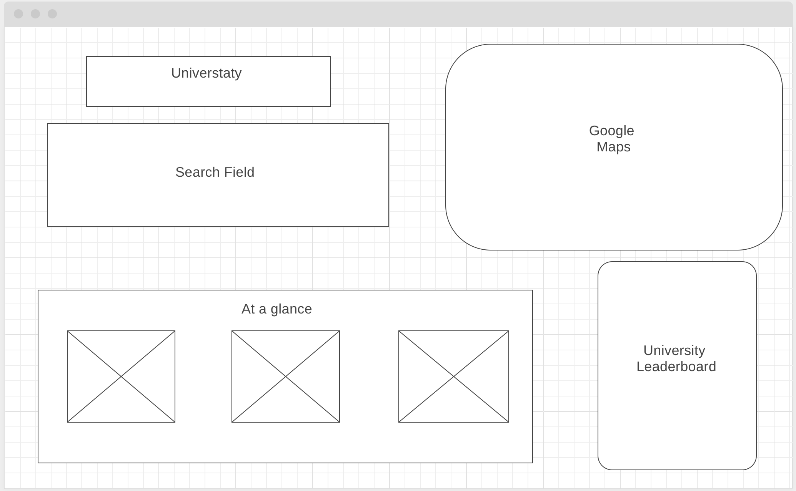
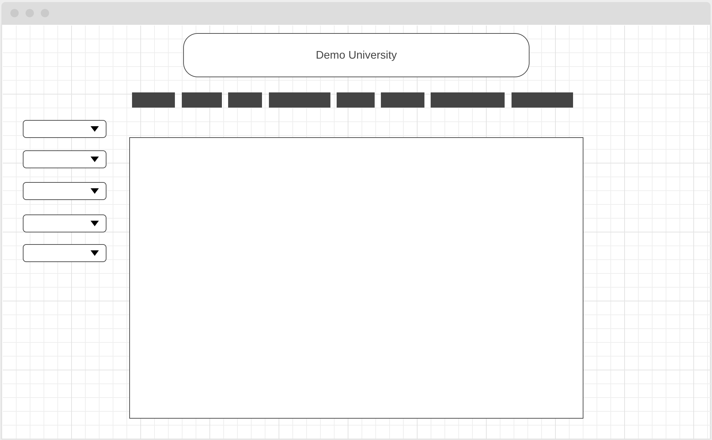

# Universtaty 

## Overview 
As a former high school teacher, a major part of my job was preparing students for university. Students were always overwhelmed by the vast and convoluted college pamphlets and brochures. This visualization if an objective view on college statistics that is meant to be easily digestible.

The project seeks to make the process of looking through universities simple and interactive. Students will be able to filter locations as well as a plethora of other statistics including but not limited to, diversity, standardized scores and graduation rates. Prospective students will then be able to pin different universities and compare their statistics.

## Technologies 
* D3
  * D3 will be used to chart the statistics between various universities.
* JS
  * Javascript will comprise the front-end of the project.
* Various APIs
  * https://collegescorecard.ed.gov/data/ & https://nces.ed.gov/ipeds/use-the-data
    * Api used for getting university data. 
  * Google Maps API
    * Allow users to get a location of their universities on a map.
  * MediaWiki API 
    * https://www.mediawiki.org/wiki/API:Main_page
    * used for photos and college about me information

## Project Timeline

* Day 1 - Explore D3, set up tentative file sctructure
  * Go through d3 documentation and outline essential aspects that will be utilizedin the project.
  * Set up the project directory and file skeleton.

* Day 2 - Implement search
  * Users will be able to search for universities by various criteria.
  * The search bar will include sliders for GPA, ACT/SAT scores, price.

* Day 3 - Implement Google Maps API
  * The map will populate with the information from the search criteria. 
  * The map will have onClick event listeners to delve deeper into college statistics.

 * Day 4 - Implement data visualization for university statistics
   * universities will display post graduation employment
   * doughnut charts will break down diversity
   * charts will display graduation statistics

* Day 5 - Implement a leaderboard table which sorts universities by most desired criteria
  * Filter search and style the leader to be interactive and show snapshot of information.

* Day 6 - Styling Day
  * Work on cleaning up any styling

## Bonus Features
* Users can compare two or more universities to each other
* Users can look at universities by major and compare job prospects against the bls job projections.
* Users can choose universities that are within a certain radius of a desired location.

## Wireframe

